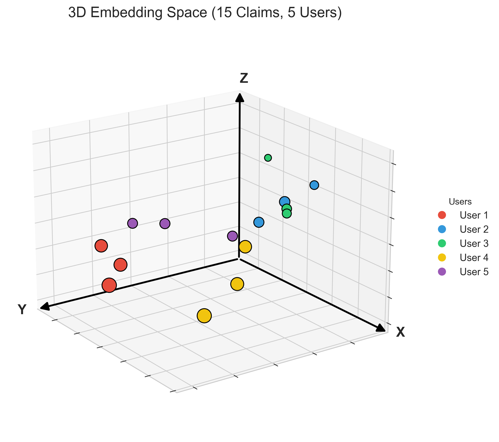

## Platform-Independent Semantic Graph Construction for Political Community Modeling on Social Media
Master Thesis,
Ensimag - KTH - Agoratlas

---

## Résumé / Abstract
TODO: à la fin

---

## Introduction

### Contexte et motivation
L'analyse des discours en ligne à l'échelle des réseaux sociaux est un enjeu croissant,
tant pour comprendre la formation de l'opinion publique que pour détecter des phénomènes
comme la polarisation ou la propagation de narratives. Les approches existantes reposent
sur des graphes d'interactions (retweets, mentions, commentaires), dont la nature dépend
fortement de la plateforme considérée, ce qui rend toute comparaison cross-plateforme
directe impossible, ou les graphes sémantiques par mots communs (fondés sur le vocabulaire partagé), qui ne sont que rarement utiles.

Une alternative est de construire des graphes fondés non pas sur les interactions entre
utilisateurs, mais sur la **proximité sémantique de leurs discours**. Un tel graphe serait
indépendant de la plateforme et potentiellement plus représentatif des proximités
idéologiques réelles.

### Question de recherche

> La construction d'un graphe à partir de l'embedding de contenus textuels
> est-elle une meilleure approche pour représenter les proximités idéologiques entre
> utilisateurs, comparée à des approches existantes telles que le graphe sémantique
> par mots communs ou le graphe d'interactions ?

### Périmètre et contributions
Ce travail se concentre sur la **construction et l'évaluation de graphes sémantiques**,
à partir de données issues de la plateforme Telegram. L'analyse cross-plateforme constitue
la motivation à long terme mais dépasse le cadre de cette thesis.

Les contributions principales sont :
- Un pipeline de construction de graphes sémantiques à partir de l'embedding de contenus.
- Plusieurs méthodes de construction de graphes, testées et comparées.
- Une métrique d'évaluation de la qualité des graphes basée sur des repères politiques
  identifiés.

### Structure du rapport
TODO: à la fin

---

## État de l'art (Related Work)

Cette section présente les travaux existants sur lesquels ce travail s'appuie directement,
ainsi que le positionnement de cette thesis par rapport à la littérature.

### Graphes d'interactions sur les réseaux sociaux
TODO: Revue des approches existantes (graphes de retweets, mentions, communautés).
Mentionner l'algorithme de Louvain pour la détection de communauté + Algo FA2

### Représentation sémantique de contenu textuel
TODO: Revue des approches de vectorisation (TF-IDF, word embeddings, sentence embeddings).
Mentionner les modèles d'embedding utilisés dans la littérature pour des tâches similaires.

### Extraction de claims
TODO: Présenter les différentes approches existantes pour transformer des textes hétérogènes
en unités comparables (extraction de mots-clés, résumé, NLP classique, LLM-based).

Travail de référence principal :
> arXiv:2510.09464v2 : *Cross-Platform Narrative Prediction: Leveraging
> Platform-Invariant Discourse Networks*

Ce papier propose un pipeline combinant extraction de claims par LLM et embedding pour
construire des réseaux de narratives cross-plateformes. Ce travail s'en inspire directement
pour les étapes d'extraction et d'embedding, en concentrant la contribution sur l'étape
de construction du graphe.

### Évaluation de graphes
TODO: Revue des métriques existantes pour évaluer la qualité de graphes sociaux/sémantiques.
Justifier pourquoi une métrique basée sur des repères politiques est adoptée ici.

---

## Données

### Source et période
Les données utilisées sont des données Telegram collectées par l'entreprise d'accueil
dans le cadre d'études internes, sur la période **février–mars 2026**.

Le choix de Telegram présente un intérêt particulier : il s'agit d'une plateforme pour
laquelle l'entreprise ne dispose pas encore de méthode pertinente de représentation sous forme de graphe (le graph sémantique par mots communs n'a aucune plus value).

> **Note :** Le pipeline a été conçu de manière générique afin de pouvoir être appliqué facilement
> à d'autres plateformes (Twitter, TikTok, etc.) dans des travaux futurs.

### Filtrage
Pour les données Telegram utilisées dans ce travail, aucun filtrage préalable n'a été
nécessaire en raison du volume de données relativement limité. Des critères de filtrage
(volume de contenu par utilisateur, longueur des textes, etc.) pourraient être pertinents
pour des jeux de données plus volumineux issus d'autres plateformes.

---

## Pipeline technique

Cette section décrit les étapes techniques communes à toutes les méthodes de construction
de graphe. L'objectif de ces étapes est de transformer des textes bruts en vecteurs
numériques exploitables.

[Textes bruts] → [Extraction de claims] → [Embedding] → [Construction du graphe]

Les étapes d'extraction et d'embedding des claims sont fixes tout au long de ce travail, afin de limiter le nombre de variables et d'isoler l'impact des choix effectués à l'étape de construction
du graphe.
### Extraction de claims

**Objectif :** Transformer des contenus hétérogènes en unités sémantiquement comparables.

L'approche retenue est l'utilisation d'un **LLM via API** pour extraire les claims d'un
texte. Un même texte peut contenir plusieurs claims, qui sont ensuite parsés
individuellement.

Le prompt utilisé est celui du papier **arXiv:2510.09464v2** (voir Annexe A).

Ce choix est délibéré : l'extraction de claims n'est pas l'objet principal de ce travail,
et fixer cette étape permet de limiter les variables à l'étape de construction du graphe.

>  **Note :** La qualité de l'extraction de claims n'a pas été évaluée indépendamment
> dans ce travail. La méthode est adoptée telle quelle sur la base des validations
> effectuées par les auteurs du papier de référence.
> TODO : À compléter ou supprimer si j'ajoute un test plus tard

### Embedding

**Objectif :** Associer à chaque claim un vecteur numérique, de sorte que deux claims
sémantiquement proches soient représentés par des vecteurs proches dans l'espace
d'embedding.

Le modèle utilisé est **Qwen3 Embedding 0.6B**, qui projette chaque claim dans un espace
à **1024 dimensions**. Les embeddings sont normalisés (normalisation L2), ce qui rend
la distance euclidienne et la similarité cosine équivalentes.

Ce modèle a été choisi comme compromis entre performance et coût de calcul. Des modèles
plus grands pourraient améliorer la qualité des embeddings mais sortent du périmètre de
ce travail.

> **Note :** Le modèle Qwen3 Embedding 0.6B est un modèle multilingue.
> Or, l'étape d'extraction de claims via LLM produit systématiquement des claims
> en anglais, quelle que soit la langue du texte source. Un modèle d'embedding
> plus petit mais spécialisé en anglais (par exemple, `all-MiniLM-L6-v2`)
> pourrait potentiellement offrir des performances comparables, voire supérieures,
> pour un coût de calcul moindre. Ce compromis n'a pas été exploré dans le cadre
> de ce travail mais constitue une piste d'optimisation pertinente.



**Référence :**
> Enevoldsen et al. (2025). *MMTEB: Massive Multilingual Text Embedding Benchmark.*
> arXiv:2502.13595.

### Pourquoi construire un graphe à partir de l'espace d'embedding ?

Une objection naturelle est que l'espace d'embedding contient déjà toute
l'information sémantique nécessaire, et que la construction d'un graphe ne fait
que perdre de l'information en transformant des vecteurs dans un espace à plus de 1000 dimensions en simple liste t'arrêtes. Deux raisons
justifient néanmoins cette étape :

**Passage du niveau des claims au niveau des utilisateurs.**
L'espace d'embedding contient des *claims*, non des *utilisateurs*. Or, l'objectif
final est de modéliser les proximités entre utilisateurs. La construction d'un graphe
permet d'agréger les relations entre claims en relations entre utilisateurs, sans se
limiter à une représentation géométrique unique (comme le centroïde), dont nous verrons
par la suite les limites.

**Visualisation et exploration par Force Atlas 2.**
Les graphes produits sont visualisés à l'aide de l'algorithme Force Atlas 2 (FA2).
Bien que FA2 ne fournisse pas de garanties géométriques rigoureuses comparables à
celles d'une ACP ou d'un t-SNE, il constitue un outil particulièrement efficace pour
révéler des structures de communauté dans des données de haute dimension difficilement
interprétables par d'autres moyens. Cette capacité de visualisation est au cœur de la
motivation de ce travail : évaluer si un graphe sémantique construit par embedding
peut produire des représentations aussi exploitables que les graphes d'interaction
traditionnels, et potentiellement ouvrir la voie à des analyses dans des contextes
plus larges (par exemple, les discours parlementaires).
 
---
## Méthodes de construction de graphe

Cette section constitue le cœur de la contribution de cette thesis. L'objectif est de
construire un **graphe d'utilisateurs** où le poids d'une arête entre deux nœuds reflète
la proximité sémantique de leurs discours, à partir des embeddings produits à l'étape
précédente.

Huit méthodes sont proposées et comparées : une baseline par mots communs, et 7 méthodes
basées sur l'embedding. Des paramètres et définitions communs à plusieurs méthodes sont
d'abord introduits.

### Définitions et paramètres communs

#### Centroïde d'un utilisateur
La notion de centroïde est utilisée dans plusieurs méthodes. Pour un utilisateur
possédant $n$ claims, son centroïde est la moyenne de ses vecteurs de claims dans
l'espace d'embedding :

$$\text{Centroid}_u = \frac{1}{n} \sum_{i=1}^{n} \vec{c_i}$$

Le centroïde représente la position "moyenne" d'un utilisateur dans l'espace sémantique.
Cette représentation est compacte, un seul vecteur par utilisateur, mais perd
l'information sur la distribution des claims autour de ce centre.

TODO opt: Visualisation
#### Similarité cosine et convention de poids
Du fait de la normalisation L2 des embeddings, la distance cosine et la distance
euclidienne sont équivalentes et représentent la même grandeur. L'ensemble des méthodes
utilise la distance cosine de manière uniforme, par souci de cohérence.

On définit la **similarité cosine** entre deux vecteurs $\vec{a}$ et $\vec{b}$ comme :

$$\text{sim}(\vec{a}, \vec{b}) = 1 - d_{\cos}(\vec{a}, \vec{b})$$

Une similarité de 1 indique des vecteurs identiques, une similarité de 0 indique des
vecteurs orthogonaux.

Sauf mention contraire, le poids d'une arête entre deux nœuds est défini directement
comme cette similarité :

$$W(\vec{a}, \vec{b}) = \text{sim}(\vec{a}, \vec{b})$$

Les cas où une transformation supplémentaire est appliquée (normalisation par nombre
de claims) sont explicités dans la description de chaque méthode concernée.

#### Normalisation par nombre de claims
Lorsqu'un poids d'arête est agrégé à partir de plusieurs paires de claims, il est
normalisé pour éviter de favoriser artificiellement les utilisateurs ayant beaucoup de claims associés :

$$W_{norm}(u, v) = \frac{W_{raw}(u, v)}{\sqrt{n_u \cdot n_v}}$$

où $n_u$ et $n_v$ sont les nombres de claims respectifs des utilisateurs $u$ et $v$.

#### Pruning
Afin d'éviter un graphe trop dense, il est possible de supprimer les arêtes dont le
poids est inférieur à un seuil. Ce seuil est défini comme un **percentile** : on supprime
les $p\%$ d'arêtes les plus faibles. Ce paramètre a été évalué préliminairement sur les
méthodes `centroid_simple` et `claim_knn` à titre représentatif. Les résultats ne
montrant pas d'amélioration significative des métriques d'évaluation, ce paramètre est
fixé à $p = 0$ pour l'ensemble des méthodes afin de limiter l'espace de recherche.
Cette analyse préliminaire est présentée en Annexe TODO.

---

### Baseline : Graphe sémantique par mots communs

Cette méthode sert de **baseline**. Elle correspond à l'approche déjà utilisée en
interne et ne fait pas appel à l'embedding.

**Principe :** Les stopwords sont supprimés de chaque texte. Deux utilisateurs sont
connectés par une arête si leurs textes partagent des mots en commun. Le poids de
l'arête est proportionnel au nombre de mots partagés.

**Limites :** Cette approche ne capture pas la sémantique (deux synonymes ne créent
pas de lien). Les résultats sont variables selon le contexte : performants sur des
biographies courtes et homogènes (ex : Sur LinkedIn appliquer un graphe sémantique sur les biographie des utilisateurs donne de bons cluster de métiers), mais généralement peu représentatifs de proximités idéologiques sur des données de posts de réseaux sociaux généralistes.

>**Note** : Avec les données de Telegram nous n'avons pas de liens entre les
>différentes chaines donc nous ne pouvons pas faire de graph d'interaction
>classique (d'où l'insteret de vouloir faire mieux que le graphe sémantique
>par mots communs )

---

### Proximité des centroïdes (`centroid_simple`)

Cette méthode est la plus directe : chaque utilisateur est réduit à son centroïde,
et les arêtes sont construites à partir des similarités cosines entre centroïdes.

**Principe :**
1. Calculer le centroïde de chaque utilisateur.
2. Calculer la matrice de distances cosines entre tous les centroïdes.
3. Connecter chaque paire d'utilisateurs $(u, v)$ par une arête de poids :

$$W(u, v) = \text{sim}(\text{Centroid}_u, \text{Centroid}_v)$$

Tous les utilisateurs sont connectés entre eux (graphe complet avant pruning).

**Variables testées :**
- Pourcentage de pruning $p$ *(évaluation préliminaire uniquement, voir section 5.1)*

**Avantages :** Simple, peu coûteux en calcul, et directement interprétable. Le poids
d'une arête correspond exactement à la similarité sémantique entre les discours moyens
de deux utilisateurs.

**Limites :** Deux utilisateurs aux discours très variés mais dont les centroïdes
coïncident par effet de moyenne peuvent apparaître artificiellement proches.

---

### KNN sur les centroïdes (`centroid_knn`)

Cette méthode est l'analogue de `claim_knn` appliquée au niveau des centroïdes,
et l'équivalent asymétrique de `centroid_mknn`.

**Principe :**
1. Calculer le centroïde de chaque utilisateur.
2. Pour chaque utilisateur $u$, connecter $u$ vers chacun de ses $K$ plus proches
   voisins $v$ dans l'espace des centroïdes.
3. Le poids de l'arête dirigée $u \rightarrow v$ est la similarité cosine entre
   leurs centroïdes :

$$W(u \rightarrow v) = \text{sim}(\text{Centroid}_u, \text{Centroid}_v)$$

Le graphe est **dirigé** : si $v$ est dans le voisinage de $u$, l'arête $u \rightarrow v$
est créée indépendamment de l'existence de $v \rightarrow u$. Contrairement à
`claim_knn`, il n'y a pas d'accumulation de poids puisque chaque utilisateur n'est
représenté que par un seul vecteur — le poids d'une arête est donc directement la
similarité cosine entre les deux centroïdes.

**Variables testées :**
- Nombre de voisins $K$

**Avantages :** Capture l'asymétrie des proximités — $u$ peut considérer $v$ comme
proche sans que la réciproque soit vraie. Plus flexible que `centroid_mknn` qui
requiert la mutualité.

**Limites :** Hérite des limites du centroïde (effet de moyenne). Un utilisateur
avec un centroïde "central" dans l'espace d'embedding peut se retrouver dans le
voisinage de beaucoup d'autres utilisateurs sans que cela reflète une réelle
proximité idéologique.

### KNN sur les claims (`claim_knn`)

Plutôt que de résumer un utilisateur par son centroïde, cette méthode travaille
directement au niveau des claims individuels, puis agrège les résultats au niveau
des utilisateurs.

**Principe :**
1. Construire un graphe KNN sur l'ensemble des claims : chaque claim est connecté à
   ses $K$ plus proches voisins dans l'espace d'embedding.
2. Pour chaque paire de claims $(c_i, c_j)$ appartenant respectivement aux utilisateurs
   $u$ et $v$, si $c_j$ est dans le voisinage de $c_i$, accumuler la similarité
   $\text{sim}(c_i, c_j)$ dans le poids brut $W_{raw}(u, v)$.
3. Normaliser le poids par le nombre de claims :

$$W(u, v) = \frac{W_{raw}(u, v)}{\sqrt{n_u \cdot n_v}}$$

La relation de voisinage est ici **asymétrique** : si $c_j$ est dans le voisinage de
$c_i$, le lien est compté même si $c_i$ n'est pas dans le voisinage de $c_j$.

**Variables testées :**
- Nombre de voisins $K$

**Avantages :** Capture les proximités locales entre claims spécifiques, sans être
sensible à l'effet de moyenne du centroïde. Cela peut etre particulièrement utile dans le cas où deux utilisateurs ont dés avis radicalement opposé, mais parlent des memes sujets (Exemple 2 utilisateurs 'expriment sur la peine de mort, ce qui crée un cluster : "Discussion = peine de mort" (TODO : peut etre tourver un exemple moin fort), mais les 2 utilisateur à l'intérieur de se cluster se retrouvent dans des sous cluster distinct : Pour et Contre.  

**Limites :** Un utilisateur avec beaucoup de claims a plus d'opportunités de créer
des liens, la normalisation atténue ce biais mais ne l'élimine pas complètement.

---

### Mutual KNN sur les claims (`claim_mknn`)

Cette méthode est une variante de la méthode précédente qui introduit une contrainte
de **mutualité** : un lien entre deux claims n'est comptabilisé que si la relation de
voisinage est réciproque.

**Principe :**
Identique à `claim_knn`, à la différence que la similarité entre $c_i$ et $c_j$ n'est
accumulée que si $c_j \in \text{KNN}(c_i)$ **et** $c_i \in \text{KNN}(c_j)$.

La normalisation reste identique :

$$W(u, v) = \frac{W_{raw}(u, v)}{\sqrt{n_u \cdot n_v}}$$

**Variables testées :**
- Nombre de voisins $K$

**Avantages :** Plus conservative que `claim_knn`, les liens créés correspondent à
des proximités fortes et réciproques, ce qui tend à produire un graphe plus éparse mais
plus fiable.

**Limites :** Peut produire très peu d'arêtes si $K$ est petit

---

### Mutual KNN sur les centroïdes (`centroid_mknn`)

Cette méthode applique la contrainte de mutualité directement au niveau des centroïdes.

**Principe :**
1. Calculer le centroïde de chaque utilisateur.
2. Construire un graphe KNN sur les centroïdes.
3. Créer une arête entre $u$ et $v$ **uniquement si** $v \in \text{KNN}(u)$ **et**
   $u \in \text{KNN}(v)$.
4. Le poids de l'arête est la similarité cosine entre les centroïdes :

$$W(u, v) = \text{sim}(\text{Centroid}_u, \text{Centroid}_v)$$

**Variables testées :**
- Nombre de voisins $K$

**Avantages :** Produit un graphe naturellement éparse sans recourir au pruning :
seules les proximités les plus fortes et réciproques génèrent des arêtes.

**Limites :** Hérite des limites du centroïde (effet de moyenne). Avec un $K$ trop
petit, certains utilisateurs peuvent se retrouver isolés (aucun lien mutuel), voir le graphe peut être composé d'une multitude de composantes connexes .

---

### Shared Nearest Neighbors sur les centroïdes (`centroid_snn`)

Cette méthode s'appuie sur une notion de similarité différente : deux utilisateurs sont
proches non pas parce que leurs centroïdes sont géométriquement voisins, mais parce
qu'ils **partagent les mêmes voisins** dans l'espace d'embedding.

**Principe :**
1. Calculer le centroïde de chaque utilisateur.
2. Pour chaque utilisateur, identifier son voisinage des $K$ plus proches centroïdes.
3. Pour chaque paire $(u, v)$, calculer la **similarité de Jaccard** de leurs voisinages
   respectifs :

$$W(u, v) = \frac{|\text{KNN}(u) \cap \text{KNN}(v)|}{|\text{KNN}(u) \cup \text{KNN}(v)|}$$

Une arête n'est créée que si $|\text{KNN}(u) \cap \text{KNN}(v)| \geq \text{min\_shared}$
(fixé à 1 par défaut).

**Variables testées :**
- Nombre de voisins $K$

**Avantages :** Robuste aux outliers géométriques, deux centroïdes peuvent être
proches par hasard sans partager de voisinage commun. Capture une notion de
"communauté de voisinage" plutôt qu'une simple proximité directe.

**Limites :** Moins intuitif à interpréter. Le poids ne reflète pas directement une
distance dans l'espace d'embedding.

---
### SNN sur les claims (`claim_snn`)

Cette méthode est l'analogue de `centroid_snn` appliquée au niveau des claims
individuels plutôt qu'au niveau des centroïdes.

**Principe :**
1. Construire le voisinage KNN de chaque claim individuel dans l'espace d'embedding.
2. Pour chaque paire de claims $(c_i, c_j)$ appartenant à des utilisateurs différents
   $u$ et $v$, calculer la similarité de Jaccard de leurs voisinages :

$$\text{Jaccard}(c_i, c_j) = \frac{|\text{KNN}(c_i) \cap \text{KNN}(c_j)|}{|\text{KNN}(c_i) \cup \text{KNN}(c_j)|}$$

3. Accumuler cette similarité dans le poids brut $W_{raw}(u, v)$ si
   $|\text{KNN}(c_i) \cap \text{KNN}(c_j)| \geq \text{min\_shared}$.
4. Normaliser par le nombre de claims :

$$W(u, v) = \frac{W_{raw}(u, v)}{\sqrt{n_u \cdot n_v}}$$

Le graphe est **non dirigé** — la similarité de Jaccard étant symétrique par
définition.

**Variables testées :**
- Nombre de voisins $K$

**Avantages :** Combine les avantages du SNN (robustesse aux outliers géométriques)
et du travail au niveau des claims (pas d'effet de moyenne). Deux utilisateurs sont
proches s'ils partagent non seulement des claims similaires, mais des claims évoluant
dans le même voisinage sémantique.

**Limites :** Coûteux en calcul — la comparaison de toutes les paires de claims est
en $O(n^2)$ où $n$ est le nombre total de claims. Peut produire peu d'arêtes si
les claims sont distribués de manière très diverse dans l'espace d'embedding.
### Récapitulatif des méthodes

| Méthode                 | Niveau d'analyse | Type de lien                | Paramètre principal |
| ----------------------- | ---------------- | --------------------------- | ------------------- |
| Baseline (mots communs) | Tokens           | Mots partagés               |                     |
| `centroid_simple`       | Centroïde        | Complet pondéré             |                     |
| `claim_knn`             | Claims           | KNN asymétrique             | $K$                 |
| `claim_mknn`            | Claims           | KNN mutuel                  | $K$                 |
| `centroid_mknn`         | Centroïde        | KNN mutuel                  | $K$                 |
| `centroid_snn`          | Centroïde        | Voisinage partagé (Jaccard) | $K$                 |
| `centroid_epsilon`      | Centroïde        | Seuil absolu                | $\varepsilon$       |

## Évaluation

Cette section décrit le protocole utilisé pour évaluer et comparer les graphes produits
par les différentes méthodes.

### Problématique
Évaluer la qualité d'un graphe sémantique est difficile : il n'existe pas de vérité
terrain directe pour mesurer si un graphe représente correctement les proximités
idéologiques entre utilisateurs. Par ailleurs, des graphes de natures différentes
(interactions, mots communs, embedding) ne peuvent pas être comparés directement sur
leurs propriétés structurelles.

L'approche retenue repose sur l'utilisation de **repères politiques** identifiés : des
acteurs dont l'appartenance à un groupe politique est connue a priori. Trois métriques
complémentaires sont définies pour quantifier la qualité d'un graphe à partir de ces
repères.

### Repères politiques

**Principe :**
Des acteurs politiques identifiés sont utilisés comme **points de repère** dans le
graphe. L'hypothèse est que deux acteurs appartenant au même groupe politique devraient
être plus proches dans un graphe sémantique pertinent que deux acteurs de groupes
opposés.

> **Disclaimer :** Le recours à des groupes politiques comme repères d'évaluation
> n'implique aucune analyse ou prise de position politique de la part de ce travail.
> Ces groupes ont été sélectionnés comme référentiels empiriques sur la base d'un
> critère pragmatique : disposer de groupes idéologiquement distincts, suffisamment
> présents sur les réseaux sociaux pour fournir un volume de données exploitable.
> Des groupes plus marginaux auraient offert moins de données fiables. Ce choix
> ne s'appuie pas sur une grille d'analyse politique formalisée et ne prétend pas
> refléter l'ensemble du spectre politique.

**Groupes utilisés :**
- Extrême droite
- Gauche radicale
- Centre Droit

**Note :**
Cette métrique n'est souvent pas vérifiée dans les graphes d'interaction existants.
Par exemple, une vague de harcèlement de l'extrême droite vers la gauche peut créer
une proximité artificielle dans un graphe d'interactions, alors que les discours sont
opposés.

### Métriques d'évaluation

Trois métriques complémentaires sont utilisées pour évaluer chaque graphe. Elles
opèrent toutes sur le sous-ensemble des nœuds étiquetés (les repères politiques)
et exploitent les poids des arêtes du graphe.

#### Pureté du voisinage (*Neighborhood Purity @k*)

**Objectif :** Mesurer si les voisins les plus proches d'un acteur politique
appartiennent au même groupe que lui.

**Définition :**
Pour chaque nœud étiqueté $u$ appartenant au groupe $g$, on identifie ses $k$ voisins
les plus forts (triés par poids d'arête décroissant) parmi les nœuds étiquetés. La
pureté de $u$ est la fraction de ces voisins appartenant au même groupe $g$ :

$$\text{Purity}(u) = \frac{|\{v \in \text{TopK}(u) \mid \text{label}(v) = \text{label}(u)\}|}{|\text{TopK}(u)|}$$

La pureté par groupe est la moyenne des puretés individuelles des membres de ce groupe.
La **pureté globale** est la moyenne sur l'ensemble des nœuds étiquetés :

$$\text{Purity}_{global} = \frac{1}{|L|} \sum_{u \in L} \text{Purity}(u)$$

où $L$ est l'ensemble des nœuds étiquetés présents dans le graphe.

**Interprétation :** Une pureté proche de 1 indique que les voisins les plus proches
d'un acteur politique sont majoritairement du même bord, ce qui est le comportement
attendu d'un bon graphe sémantique. Une pureté proche de $1/|G|$ (où $|G|$ est le
nombre de groupes) suggère un voisinage aléatoire.

**Paramètre :** $k$ = le nombre de voisins considérés.

#### Ratios de poids intra/inter-groupe (*Weight Ratios*)

**Objectif :** Comparer les poids moyens des arêtes au sein d'un groupe politique aux
poids moyens des arêtes entre groupes différents.

**Définition :**
L'ensemble des calculs est restreint aux **nœuds étiquetés** uniquement.
Pour chaque groupe $g$, le **poids moyen intra-groupe** est :

$$W_{intra}(g) = \frac{1}{|\binom{g}{2}|} \sum_{(u,v) \in \binom{g}{2}} w(u, v)$$

où $w(u, v)$ est le poids de l'arête entre $u$ et $v$ (0 si l'arête n'existe pas).

Pour deux groupes $g_1$ et $g_2$, le **poids moyen inter-groupe** est :

$$W_{inter}(g_1, g_2) = \frac{1}{|g_1| \cdot |g_2|} \sum_{u \in g_1} \sum_{v \in g_2} w(u, v)$$

Le **ratio intra/inter** pour un groupe $g_1$ par rapport à un groupe $g_2$ est :

$$R(g_1, g_2) = \frac{W_{intra}(g_1)}{W_{inter}(g_1, g_2)}$$

Ce ratio est **asymétrique** : $R(g_1, g_2) \neq R(g_2, g_1)$ en général, car les
poids intra-groupe diffèrent.

Un **ratio global** est également calculé pour chaque groupe par rapport à tous les
autres nœuds étiquetés combinés :

$$R_{vs\_all}(g) = \frac{W_{intra}(g)}{W_{inter}(g, L \setminus g)}$$

**Interprétation :** Un ratio supérieur à 1 indique que les membres d'un groupe sont
en moyenne plus fortement connectés entre eux qu'avec les membres d'un autre groupe.
Plus le ratio est élevé, meilleure est la séparation. Un ratio inférieur à 1 signale
une mauvaise séparation pour la paire considérée.

> **Note :** Les arêtes manquantes sont traitées comme ayant un poids de 0. Ce
> choix est cohérent avec l'interprétation des poids comme des similarités : l'absence
> d'arête signifie l'absence de similarité détectée.

#### Conductance (*Conductance on Labeled Subgraph*)

**Objectif :** Mesurer la qualité de la séparation d'un groupe politique dans le graphe,
en utilisant une métrique classique de la théorie des graphes.

**Définition :**
Le calcul est restreint au **sous-graphe induit par les nœuds étiquetés** uniquement.
Pour un groupe $S$ au sein de ce sous-graphe :

$$\text{Conductance}(S) = \frac{\text{cut}(S, \bar{S})}{\min(\text{vol}(S), \text{vol}(\bar{S}))}$$

où :
- $\bar{S} = L \setminus S$ est le complémentaire de $S$ dans l'ensemble des nœuds
  étiquetés $L$
- $\text{cut}(S, \bar{S}) = \sum_{u \in S, v \in \bar{S}} w(u, v)$ est la somme des
  poids des arêtes traversant la frontière entre $S$ et $\bar{S}$
- $\text{vol}(S) = \sum_{u \in S} \sum_{v \in L} w(u, v)$ est le volume de $S$, c'est-à-dire la
  somme de tous les poids d'arêtes incidentes aux nœuds de $S$ dans le sous-graphe
  étiqueté

La **conductance moyenne** est la moyenne des conductances de tous les groupes.

**Interprétation :** La conductance mesure la proportion du « flux » sortant d'un
groupe par rapport à son flux total. Une conductance **faible** (proche de 0) indique
un groupe bien séparé du reste : ses arêtes internes sont fortes par rapport aux arêtes
sortantes. Une conductance **élevée** (proche de 1) indique un groupe mal séparé.

> **Note :** Le calcul de la conductance est restreint au sous-graphe des nœuds
> étiquetés pour éviter que la grande masse de nœuds non étiquetés ne domine le
> résultat. Cela permet une comparaison équitable entre méthodes, indépendamment de la
> densité globale du graphe.

### Protocole

Pour chaque méthode de construction de graphe :
1. Faire varier la (ou les) variable(s) principale(s) de la méthode.
2. Pour chaque configuration, calculer les trois métriques d'évaluation :
   - Pureté du voisinage @k
   - Ratios de poids intra/inter-groupe
   - Conductance
3. Identifier la configuration optimale.

Une fois les configurations optimales identifiées pour chaque méthode, les méthodes
sont **comparées entre elles** sur la base de ces valeurs optimales.

**Critères de comparaison :**
- Pureté globale la plus élevée
- Ratios intra/inter le plus élevée
- Conductance moyenne la plus faible

## Résultats et Discussion

Cette section présente les résultats expérimentaux obtenus, les analyse, et les discute
au regard de la question de recherche.

### Résultats par méthode
TODO: Présenter les courbes d'évolution des métriques en fonction des variables testées,
pour chaque méthode.

### Comparaison entre méthodes
TODO: Tableau comparatif des méthodes à leur configuration optimale.

### Discussion
TODO: Interpréter les résultats. Les graphes basés sur l'embedding sont-ils effectivement
meilleurs que la baseline ? Dans quelles conditions ? Quelles sont les limites observées ?

---

## Considérations éthiques

KTH requiert que les enjeux éthiques soient discutés dans le rapport. Cette section
aborde les principales questions éthiques liées à ce travail.

### Données personnelles et vie privée
Les données utilisées sont des publications publiques sur Telegram. Aucune donnée
personnelle sensible n'est collectée ou traitée au-delà de ce qui est accessible
publiquement.
TODO: Vérifier et compléter selon les conditions d'utilisation des données de l'entreprise.

### Usage des repères politiques
Comme précisé en section 6.2, le recours à des catégories politiques se limite à
un usage méthodologique comme repère d'évaluation. Aucune inférence ou conclusion
politique n'est tirée de ces classifications.

### Biais algorithmiques
TODO: Discuter des biais potentiels introduits par le modèle d'embedding (biais
linguistiques, culturels) et par l'extraction de claims via LLM.

---

## Conclusion et Perspectives

### Conclusion
TODO: Synthétiser les réponses apportées à la question de recherche.

### Perspectives
- Extension à d'autres plateformes (Twitter, TikTok) pour valider l'approche
  cross-plateforme.
- Test avec des modèles d'embedding plus grands.
- Exploration de méthodes d'extraction de claims alternatives.
- Intégration possible des graphes sémantiques avec les graphes d'interactions existants.

---
## Bibliographie

- arXiv:2510.09464v2 : *Cross-Platform Narrative Prediction: Leveraging
  Platform-Invariant Discourse Networks*
- Enevoldsen et al. (2025). *MMTEB: Massive Multilingual Text Embedding Benchmark.*
  arXiv:2502.13595.

TODO: Compléter avec toutes les références citées dans l'état de l'art.

---

## Annexes

### Annexe A : Prompt d'extraction de claims
```
You are a claim extraction system. Your job is to identify and extract all claims from the provided content.

  

## Definition of a Claim

A claim is any statement that asserts something to be true or false. This includes:

- Factual assertions (e.g., "Kamala Harris withdrew from the 2020 primaries in December 2019")

- Characterizations (e.g., "She is a phony")

- Predictions (e.g., "She's not going to win Pennsylvania")

- Policy positions (e.g., "She supports fracking now")

- Evaluative statements (e.g., "This is the most dishonest ticket in modern American history")

  

## Instructions

1. Extract ALL distinct claims from the content, regardless of whether they are true, false, opinion, or fact

2. Present each claim as a standalone statement that can be understood without additional context

3. Keep claims in their original wording as much as possible

4. Do not editorialize, fact-check, or judge the claims

5. If a claim references "she/he/they" make it clear who is being referenced by using their name

6. Extract both explicit claims and implied claims that are clearly stated

7. **Avoid repetition**: If the same claim is stated multiple times in different ways, extract it only once in its clearest form

8. **Preserve context**: If a claim uses vague language (e.g., "it is a farce", "that's crazy"), include enough context so the claim is meaningful on its own (e.g., "Kamala Harris's campaign is a farce")

  

## Output Format

Return claims as a simple numbered list:

  

1. [First claim]

2. [Second claim]

3. [Third claim]

...

  

Now extract all claims from the following content:
```
