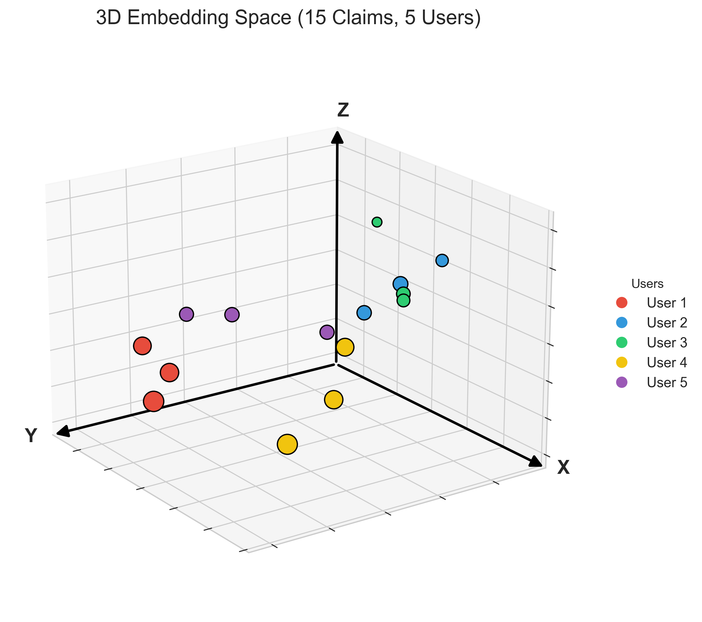

## Platform-Independent Semantic Graph Construction for Political Community Modeling on Social Media
Master Thesis,
Ensimag - KTH - Agoratlas

---

## Résumé / Abstract
TODO: à la fin

---

## Introduction

### Contexte et motivation
L'analyse des discours en ligne à l'échelle des réseaux sociaux est un enjeu croissant,
tant pour comprendre la formation de l'opinion publique que pour détecter des phénomènes
comme la polarisation ou la propagation de narratives. Les approches existantes reposent
sur des graphes d'interactions (retweets, mentions, commentaires), dont la nature dépend
fortement de la plateforme considérée, ce qui rend toute comparaison cross-plateforme
directe impossible, ou les graphes sémantiques par mots communs (fondés sur le vocabulaire partagé), qui ne sont que rarement utiles.

Une alternative est de construire des graphes fondés non pas sur les interactions entre
utilisateurs, mais sur la **proximité sémantique de leurs discours**. Un tel graphe serait
indépendant de la plateforme et potentiellement plus représentatif des proximités
idéologiques réelles.
### Question de recherche

> La construction d'un graphe à partir de l'embedding de contenus textuels
> est-elle une meilleure approche pour représenter les proximités idéologiques entre
> utilisateurs, comparée à des approches existantes telles que le graphe sémantique
> par mots communs ou le graphe d'interactions ?

### Périmètre et contributions
Ce travail se concentre sur la **construction et l'évaluation de graphes sémantiques**,
à partir de données issues de la plateforme Telegram. L'analyse cross-plateforme constitue
la motivation à long terme mais dépasse le cadre de cette thesis.

Les contributions principales sont :
- Un pipeline de construction de graphes sémantiques à partir de l'embedding de contenus.
- Plusieurs méthodes de construction de graphes, testées et comparées.
- Une métrique d'évaluation de la qualité des graphes basée sur des repères politiques
  identifiés.

### Structure du rapport
TODO: à la fin

---
## État de l'art (Related Work)

Cette section présente les travaux existants sur lesquels ce travail s'appuie directement,
ainsi que le positionnement de cette thesis par rapport à la littérature.

### Graphes d'interactions sur les réseaux sociaux
TODO: Revue des approches existantes (graphes de retweets, mentions, communautés).
Mentionner l'algorithme de Louvain pour la détection de communauté + Algo FA2

### Représentation sémantique de contenu textuel
TODO: Revue des approches de vectorisation (TF-IDF, word embeddings, sentence embeddings).
Mentionner les modèles d'embedding utilisés dans la littérature pour des tâches similaires.

### Extraction de claims
TODO: Présenter les différentes approches existantes pour transformer des textes hétérogènes
en unités comparables (extraction de mots-clés, résumé, NLP classique, LLM-based).

Travail de référence principal :
> arXiv:2510.09464v2 : *Cross-Platform Narrative Prediction: Leveraging
> Platform-Invariant Discourse Networks*

Ce papier propose un pipeline combinant extraction de claims par LLM et embedding pour
construire des réseaux de narratives cross-plateformes. Ce travail s'en inspire directement
pour les étapes d'extraction et d'embedding, en concentrant la contribution sur l'étape
de construction du graphe.

### Évaluation de graphes
TODO: Revue des métriques existantes pour évaluer la qualité de graphes sociaux/sémantiques.
Justifier pourquoi une métrique basée sur des repères politiques est adoptée ici.

---

## Technique

Cette section présente le cadre théorique du travail : de la représentation des textes
dans un espace d'embedding jusqu'à la construction et l'évaluation du graphe.

### Espace d'embedding

Un embedding associe à chaque unité textuelle (ici, un claim) un vecteur numérique
dans un espace à $d$ dimensions, de sorte que deux claims sémantiquement proches
correspondent à des vecteurs proches.

On note $X \subset \mathbb{R}^d$ le nuage de points formé par l'ensemble des claims
de tous les utilisateurs. Chaque utilisateur $u_i$ est associé à un sous-ensemble
$X_i \subset X$ correspondant à ses claims. Les $l$ utilisateurs induisent une
partition de $X$ :

$$X = X_1 \cup X_2 \cup \dots \cup X_l \quad \text{avec } X_i \cap X_j = \emptyset \text{ pour } i \neq j$$

Chaque utilisateur est ainsi représenté par un ensemble de points dans l'espace
d'embedding.

### Problématique et ground truth

Il n'existe pas de vérité directe pour juger si un graphe reflète correctement
les proximités idéologiques entre utilisateurs. L'approche retenue consiste à s'appuyer
sur des **repères politiques** connus a priori.

Certains utilisateurs du jeu de données sont des acteurs politiques dont l'appartenance
à un groupe politique est connue par avance. Ces étiquettes (labels) proviennent de
**connaissances extérieures** et ne sont pas issues d'un algorithme de clustering.
Elles ne concernent qu'un **sous-ensemble de nœuds** : la majorité des utilisateurs
ne portent aucune étiquette, mais sont conservés dans le graphe pour maintenir une
taille et une structure réalistes.

**Groupes utilisés :**
- Extrême droite
- Gauche radicale
- Centre droit

L'hypothèse centrale est qu'un graphe sémantique de bonne qualité devrait placer
les acteurs d'un même groupe politique plus proches entre eux que des acteurs de
groupes différents.

> **Disclaimer :** Le recours à des groupes politiques comme repères d'évaluation
> n'implique aucune analyse ou prise de position politique de la part de ce travail.
> Ces groupes ont été sélectionnés comme référentiels empiriques sur la base d'un
> critère pragmatique : disposer de groupes idéologiquement distincts, suffisamment
> présents sur les réseaux sociaux pour fournir un volume de données exploitable.
> Ce choix ne s'appuie pas sur une grille d'analyse politique formalisée et ne
> prétend pas refléter l'ensemble du spectre politique.

> **Note :** Cette hypothèse n'est souvent pas vérifiée dans les graphes d'interaction
> existants. Par exemple, une vague de harcèlement d'un groupe vers un autre
> peut créer une proximité artificielle dans un graphe d'interactions, alors que les
> discours sont opposés.

### Pourquoi construire un graphe à partir de l'espace d'embedding ?

Une objection naturelle est que l'espace d'embedding contient déjà toute
l'information sémantique nécessaire, et que la construction d'un graphe ne fait
que perdre de l'information en transformant des vecteurs dans un espace à plus de 1000 dimensions en simple liste t'arrêtes. Deux raisons
justifient néanmoins cette étape :

**Passage du niveau des claims au niveau des utilisateurs.**
L'espace d'embedding contient des *claims*, non des *utilisateurs*. Or, l'objectif
final est de modéliser les proximités entre utilisateurs. La construction d'un graphe
permet d'agréger les relations entre claims en relations entre utilisateurs, sans se
limiter à une représentation géométrique unique (comme le centroïde), dont nous verrons
par la suite les limites.

**Visualisation et exploration par Force Atlas 2.**
Les graphes produits sont visualisés à l'aide de l'algorithme Force Atlas 2 (FA2).
Bien que FA2 ne fournisse pas de garanties géométriques rigoureuses comparables à
celles d'une ACP ou d'un t-SNE, il constitue un outil particulièrement efficace pour
révéler des structures de communauté dans des données de haute dimension difficilement
interprétables par d'autres moyens. Cette capacité de visualisation est au cœur de la
motivation de ce travail : évaluer si un graphe sémantique construit par embedding
peut produire des représentations aussi exploitables que les graphes d'interaction
traditionnels, et potentiellement ouvrir la voie à des analyses dans des contextes
plus larges (par exemple, les discours parlementaires).

### Méthodes de construction de graphe

Cette section constitue le cœur de la contribution de cette thesis. L'objectif est
de construire un **graphe d'utilisateurs** où le poids d'une arête entre deux nœuds
reflète la proximité sémantique de leurs discours, à partir des embeddings produits
à l'étape précédente.

Huit méthodes sont proposées et comparées : une baseline par mots communs et
7 méthodes basées sur l'embedding. Des paramètres et définitions communs à
plusieurs méthodes sont d'abord introduits.

#### Définitions et paramètres communs

**Centroïde d'un utilisateur :**
Pour un utilisateur possédant $n$ claims, son centroïde est la moyenne de ses
vecteurs de claims dans l'espace d'embedding :

$$\text{Centroid}_u = \frac{1}{n} \sum_{i=1}^{n} \vec{c_i}$$

Le centroïde représente la position "moyenne" d'un utilisateur dans l'espace
sémantique. Cette représentation est compacte (un seul vecteur par utilisateur)
mais perd l'information sur la distribution des claims autour de ce centre.

**Similarité cosine et convention de poids :**
On définit la **similarité cosine** entre deux vecteurs $\vec{a}$ et $\vec{b}$ comme :

$$\text{sim}(\vec{a}, \vec{b}) = 1 - d_{\cos}(\vec{a}, \vec{b})$$

Une similarité de 1 indique des vecteurs identiques, une similarité de 0 indique
des vecteurs orthogonaux. 

**K plus proches voisins (KNN) :**
On note $\text{KNN}_K(x)$ l'ensemble des $K$ points les plus proches de $x$ dans
l'espace d'embedding (au sens de la distance cosine). Cette notation s'applique
aussi bien aux claims qu'aux centroïdes selon le contexte.

**Normalisation par nombre de claims :**
Lorsqu'un poids d'arête est agrégé à partir de plusieurs paires de claims, il est
normalisé pour éviter de favoriser artificiellement les utilisateurs ayant beaucoup
de claims :

$$W_{norm}(u, v) = \frac{W_{raw}(u, v)}{\sqrt{n_u \cdot n_v}}$$

où $n_u$ et $n_v$ sont les nombres de claims respectifs des utilisateurs $u$ et $v$.

#### Baseline : Graphe sémantique par mots communs

- **Nœud :** un utilisateur.
- **Arête :** deux utilisateurs sont connectés s'ils partagent au moins un mot
  en commun (hors stopwords).
- **Poids $W$ :** nombre de mots partagés.

Cette méthode sert de référence. Elle ne fait pas appel à l'embedding.

#### Proximité des centroïdes (`centroid_simple`)

- **Nœud :** un utilisateur, représenté par le centroïde de ses claims.
- **Arête :** toutes les paires d'utilisateurs sont connectées (graphe complet).
- **Poids $W(u, v)$ :** similarité cosine entre les centroïdes,
  $W(u, v) = \text{sim}(\text{Centroid}_u, \text{Centroid}_v)$.

#### KNN sur les centroïdes (`centroid_knn`)

- **Nœud :** un utilisateur, représenté par son centroïde.
- **Arête :** $u \rightarrow v$ existe si $v \in \text{KNN}_K(u)$ dans
  l'espace des centroïdes.
- **Poids $W(u \rightarrow v)$ :** similarité cosine entre les centroïdes.

**Variable testée :** nombre de voisins $K$.

#### KNN sur les claims (`claim_knn`)

- **Nœud :** un utilisateur.
- **Arête :** deux utilisateurs $u$ et $v$ sont connectés si au moins un claim de
  $v$ apparaît dans $\text{KNN}_K$ d'un claim de $u$.
- **Poids $W(u, v)$ :** somme des similarités cosines entre toutes les paires de
  claims $(c_i \in X_u,\ c_j \in X_v)$ telles que $c_j \in \text{KNN}_K(c_i)$,
  normalisée par $\sqrt{n_u \cdot n_v}$.

La relation de voisinage est **asymétrique** : si $c_j \in \text{KNN}_K(c_i)$, le
lien est compté même si $c_i \notin \text{KNN}_K(c_j)$.

**Variable testée :** nombre de voisins $K$.

#### Mutual KNN sur les claims (`claim_mknn`)

- **Nœud :** un utilisateur.
- **Arête :** deux utilisateurs sont connectés si au moins une paire de claims
  $(c_i, c_j)$ vérifie la contrainte de mutualité :
  $c_j \in \text{KNN}_K(c_i)$ **et** $c_i \in \text{KNN}_K(c_j)$.
- **Poids $W(u, v)$ :** somme des similarités cosines des paires mutuellement
  voisines, normalisée par $\sqrt{n_u \cdot n_v}$.

**Variable testée :** nombre de voisins $K$.

#### Mutual KNN sur les centroïdes (`centroid_mknn`)

- **Nœud :** un utilisateur, représenté par son centroïde.
- **Arête :** $u$ et $v$ sont connectés si $v \in \text{KNN}_K(u)$ **et**
  $u \in \text{KNN}_K(v)$.
- **Poids $W(u, v)$ :** similarité cosine entre les centroïdes.

**Variable testée :** nombre de voisins $K$.

#### Shared Nearest Neighbors sur les centroïdes (`centroid_snn`)

- **Nœud :** un utilisateur, représenté par son centroïde.
- **Arête :** deux utilisateurs sont connectés s'ils partagent au moins un voisin
  commun parmi leurs $K$ plus proches voisins respectifs.
- **Poids $W(u, v)$ :** similarité de Jaccard entre les voisinages :

$$W(u, v) = \frac{|\text{KNN}_K(u) \cap \text{KNN}_K(v)|}{|\text{KNN}_K(u) \cup \text{KNN}_K(v)|}$$

**Variable testée :** nombre de voisins $K$.

#### SNN sur les claims (`claim_snn`)

- **Nœud :** un utilisateur.
- **Arête :** deux utilisateurs sont connectés si au moins une paire de leurs
  claims partage des voisins communs dans l'espace d'embedding.
- **Poids $W(u, v)$ :** somme des similarités de Jaccard entre les voisinages
  des paires de claims, normalisée par $\sqrt{n_u \cdot n_v}$.

**Variable testée :** nombre de voisins $K$.

### Evaluation

Trois métriques sont utilisées pour évaluer chaque graphe. Toutes opèrent sur le
sous-ensemble des nœuds étiquetés (les repères politiques) et exploitent les poids
$W$ des arêtes.

#### Pureté du voisinage (*Neighborhood Purity)

**Objectif :** Mesurer si les voisins les plus proches d'un acteur politique
appartiennent au même groupe que lui.

On définit $\text{TopK}(u)$ comme l'ensemble des $k$ nœuds étiquetés ayant les
poids d'arête $W$ les plus élevés avec $u$ (ses $k$ voisins étiquetés les plus
fortement connectés).

Pour chaque nœud étiqueté $u$ appartenant au groupe $g$, la pureté est la
proportion de nœuds de $\text{TopK}(u)$ appartenant au même groupe $g$ :

$$\text{Purity}(u) = \frac{|\{v \in \text{TopK}(u) \mid \text{label}(v) = g\}|}{k}$$

La **pureté globale** est la moyenne sur l'ensemble des nœuds étiquetés. Une
pureté proche de 1 indique que les voisins les plus proches d'un acteur politique
sont majoritairement du même bord. Une pureté proche de $1/|G|$ (où $|G|$ est le
nombre de groupes) suggère un voisinage aléatoire.

**Paramètre :** $k$ = nombre de voisins considérés.

#### Ratios de poids intra/inter-groupe (*Weight Ratios*)

**Objectif :** Comparer les poids moyens des arêtes au sein d'un groupe politique
aux poids moyens des arêtes entre groupes différents.

**Définition :**
L'ensemble des calculs est restreint aux **nœuds étiquetés** uniquement.
Pour chaque groupe $g$, le **poids moyen intra-groupe** est :

$$W_{intra}(g) = \frac{1}{|\binom{g}{2}|} \sum_{(u,v) \in \binom{g}{2}} w(u, v)$$

où $w(u, v)$ est le poids de l'arête entre $u$ et $v$ (0 si l'arête n'existe pas).

Pour deux groupes $g_1$ et $g_2$, le **poids moyen inter-groupe** est :

$$W_{inter}(g_1, g_2) = \frac{1}{|g_1| \cdot |g_2|} \sum_{u \in g_1} \sum_{v \in g_2} w(u, v)$$

Le **ratio intra/inter** pour un groupe $g_1$ par rapport à un groupe $g_2$ est :

$$R(g_1, g_2) = \frac{W_{intra}(g_1)}{W_{inter}(g_1, g_2)}$$

Ce ratio est **asymétrique** : $R(g_1, g_2) \neq R(g_2, g_1)$ en général, car les
poids intra-groupe diffèrent.

Un **ratio global** est également calculé pour chaque groupe par rapport à tous les
autres nœuds étiquetés combinés :

$$R_{vs\_all}(g) = \frac{W_{intra}(g)}{W_{inter}(g, L \setminus g)}$$

**Interprétation :** Un ratio supérieur à 1 indique que les membres d'un groupe sont
en moyenne plus fortement connectés entre eux qu'avec les membres d'un autre groupe.
Plus le ratio est élevé, meilleure est la séparation. Un ratio inférieur à 1 signale
une mauvaise séparation pour la paire considérée.

> **Note :** Les arêtes manquantes sont traitées comme ayant un poids de 0. Ce
> choix est cohérent avec l'interprétation des poids comme des similarités : l'absence
> d'arête signifie l'absence de similarité détectée.

#### Conductance (*Conductance on Labeled Subgraph*)

**Objectif :** Mesurer la qualité de la séparation d'un groupe politique dans le graphe,
en utilisant une métrique classique de la théorie des graphes.

**Définition :**
Le calcul est restreint au **sous-graphe induit par les nœuds étiquetés** uniquement.
Pour un groupe $S$ au sein de ce sous-graphe :

$$\text{Conductance}(S) = \frac{\text{cut}(S, \bar{S})}{\min(\text{vol}(S), \text{vol}(\bar{S}))}$$

où :
- $\bar{S} = L \setminus S$ est le complémentaire de $S$ dans l'ensemble des nœuds
  étiquetés $L$
- $\text{cut}(S, \bar{S}) = \sum_{u \in S, v \in \bar{S}} w(u, v)$ est la somme des
  poids des arêtes traversant la frontière entre $S$ et $\bar{S}$
- $\text{vol}(S) = \sum_{u \in S} \sum_{v \in L} w(u, v)$ est le volume de $S$,
  la somme de tous les poids d'arêtes incidentes aux nœuds de $S$ dans le
  sous-graphe étiqueté

Une conductance **faible** (proche de 0) indique un groupe bien séparé. Une
conductance **élevée** (proche de 1) indique un groupe mal séparé.

---

## Expérience

Cette section détaille la mise en pratique du pipeline théorique : les données utilisées, les choix d'implémentation et les résultats obtenus.

### Données

Les données utilisées sont des données Telegram collectées par l'entreprise d'accueil dans le cadre d'études internes, sur la période **février-mars 2026**.

Le choix de Telegram présente un intérêt particulier : il s'agit d'une plateforme pour laquelle l'entreprise ne dispose pas encore de méthode pertinente de représentation sous forme de graphe (le graphe sémantique par mots communs n'a aucune plus-value ici, car il n'y a pas de liens d'interaction classiques entre les chaînes étudiées).

> **Note :** Le pipeline a été conçu de manière générique afin de pouvoir être appliqué facilement à d'autres plateformes (Twitter, TikTok, etc.) dans des travaux futurs.

Pour les données Telegram utilisées dans ce travail, aucun filtrage préalable n'a été nécessaire en raison du volume de données relativement limité. Des critères de filtrage pourraient être pertinents pour des jeux de données plus volumineux.

### Pipeline en concret

Les étapes d'extraction et d'embedding des claims sont fixes tout au long de ce travail, afin de limiter le nombre de variables et d'isoler l'impact des méthodes de construction du graphe.

**Extraction de claims :**
L'approche retenue est l'utilisation d'un **LLM via API** pour extraire les claims d'un texte. Un même texte peut contenir plusieurs claims, qui sont ensuite parsés individuellement. Le prompt utilisé (voir Annexe A) est celui du papier arXiv:2510.09464v2. Ce choix est délibéré et permet de s'appuyer sur leurs validations.

**Modèle d'embedding :**
Le modèle utilisé est **Qwen3 Embedding 0.6B**, qui projette chaque claim dans un espace à **1024 dimensions**. Les embeddings sont normalisés avec la norme L2. Ce modèle multilingue a été choisi comme compromis entre performance et coût de calcul. (Une piste d'optimisation serait d'utiliser un modèle spécialisé en anglais puisque les claims sont extraits en anglais par le LLM).



### Résultats (Visualisations)

#### Résultats par méthode
TODO: Présenter les graphiques de métriques et les courbes d'évolution en fonction des variables testées (comme le paramètre $K$), pour chaque méthode.

#### Comparaison entre méthodes
TODO: Tableau comparatif des méthodes à leur configuration optimale.

#### Discussion
TODO: Interpréter les résultats. Les graphes basés sur l'embedding sont-ils effectivement meilleurs que la baseline ? Dans quelles conditions ? Quelles sont les limites observées ?

---

## Considérations éthiques

KTH requiert que les enjeux éthiques soient discutés dans le rapport. Cette section aborde les principales questions éthiques liées à ce travail.

### Données personnelles et vie privée
Les données utilisées sont des publications publiques sur Telegram. Aucune donnée personnelle sensible n'est collectée ou traitée au-delà de ce qui est accessible publiquement.
TODO: Vérifier et compléter selon les conditions d'utilisation des données de l'entreprise.

### Usage des repères politiques
Comme précisé dans la section Technique, le recours à des catégories politiques se limite à un usage méthodologique comme repère d'évaluation. Aucune inférence ou conclusion politique n'est tirée de ces classifications.

### Biais algorithmiques
TODO: Discuter des biais potentiels introduits par le modèle d'embedding (biais linguistiques, culturels) et par l'extraction de claims via LLM.

---

## Conclusion et Perspectives

### Conclusion
TODO: Synthétiser les réponses apportées à la question de recherche.

### Perspectives
- Extension à d'autres plateformes (Twitter, TikTok) pour valider l'approche cross-plateforme.
- Test avec des modèles d'embedding plus grands.
- Exploration de méthodes d'extraction de claims alternatives.
- Intégration possible des graphes sémantiques avec les graphes d'interactions existants.

---

## Bibliographie

- arXiv:2510.09464v2 : *Cross-Platform Narrative Prediction: Leveraging Platform-Invariant Discourse Networks*
- Enevoldsen et al. (2025). *MMTEB: Massive Multilingual Text Embedding Benchmark.* arXiv:2502.13595.

TODO: Compléter avec toutes les références citées dans l'état de l'art.

---

## Annexes

### Annexe A : Prompt d'extraction de claims
```
You are a claim extraction system. Your job is to identify and extract all claims from the provided content.

## Definition of a Claim

A claim is any statement that asserts something to be true or false. This includes:

- Factual assertions (e.g., "Kamala Harris withdrew from the 2020 primaries in December 2019")

- Characterizations (e.g., "She is a phony")

- Predictions (e.g., "She's not going to win Pennsylvania")

- Policy positions (e.g., "She supports fracking now")

- Evaluative statements (e.g., "This is the most dishonest ticket in modern American history")

## Instructions

1. Extract ALL distinct claims from the content, regardless of whether they are true, false, opinion, or fact

2. Present each claim as a standalone statement that can be understood without additional context

3. Keep claims in their original wording as much as possible

4. Do not editorialize, fact-check, or judge the claims

5. If a claim references "she/he/they" make it clear who is being referenced by using their name

6. Extract both explicit claims and implied claims that are clearly stated

7. **Avoid repetition**: If the same claim is stated multiple times in different ways, extract it only once in its clearest form

8. **Preserve context**: If a claim uses vague language (e.g., "it is a farce", "that's crazy"), include enough context so the claim is meaningful on its own (e.g., "Kamala Harris's campaign is a farce")

## Output Format

Return claims as a simple numbered list:

1. [First claim]

2. [Second claim]

3. [Third claim]

...

Now extract all claims from the following content:
```
